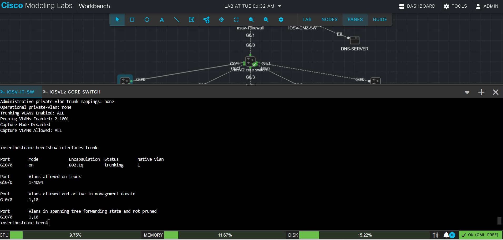

###  IT switch 
```
enable
configure terminal
interface gigabitEthernet 0/0
switchport mode trunk
no shutdown
end 
```
### note 
if switch say trunk encapsulation is "Auto" we need to set the trunk encapsulation to 802.1Q.
```
enable
configure terminal
interface gigabitEthernet 0/0
switchport trunk encapsulation dot1q
switchport mode trunk
show interfaces trunk(verify)
```
### This makes the Core ↔ IT switch link a trunk, so it can carry multiple VLANs.
Think of a trunk as a cable that can carry multiple VLANs at the same time.

### IOSV-IT-SW, configure the port going to IT-PC1 as an access port in VLAN 10
```
enable
configure terminal
interface gigabitEthernet 0/1
switchport mode access
switchport access vlan 10
no shutdown
end
```
### IT-PC2
```
enable
configure terminal
interface gigabitEthernet 0/2
switchport mode access
switchport access vlan 10
no shutdown
end
```
### move to the core switch and give accces to trunk mode 

