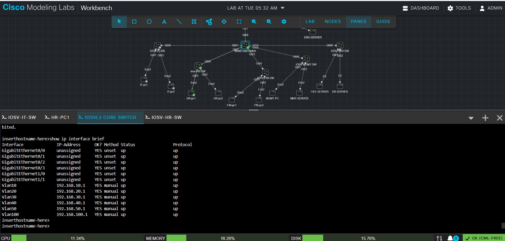

troubleshoot-1
## HR-PC1
here iam trying to ping the gate way "ping -c 4 192.168.20.1" but 100% packet loss  
checking the VLAN 20 is up on the Core switch .
``` show ip interface brief ```


core swich is config correctly VLAN 20 is up/up
then trying again to ping ping -c 4 192.168.20.1
``` show interfaces trunk `` check the On IOSV-HR-SW, run:
HR-SW Gi0/0 is definitely trunking, and VLAN 20 is allowed and forwarding.

### checking the core switch port
```show interfaces gigabitEthernet 0/2 switchport ``

We found the problem: Core Gi0/2 is still static access VLAN 20, so it is not a trunk.

### chnage the static acces 
```
enable
configure terminal
interface gigabitEthernet 0/2
switchport trunk encapsulation dot1q
switchport mode trunk
no shutdown
end
```

